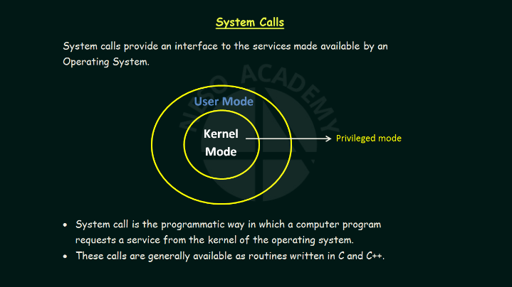

#  LIST OF C10 EXERCISES

| EXERCISE                                   | DESCRIPTION                      |
|--------------------------------------------|----------------------------------|
| [display_file.c](./ex00/ft_display_file.c) | [display_file](./ex00/readme.md) |
| [ft_cat.c](./ex01)                         | [cat](./ex01/readme.md)          |
| [ft_tail.c](./ex02)                        | [tail](./ex02/readme.md)         |
| [ft_hexdump.c](./ex03)                     | [hexdump](./ex03/readme.md)      |
| [ft_last.c](./ex04)                        | [last](./ex04/readme.md)         |

# SYSTEM CALLS

System calls are a fundamental component of modern operating systems. They are mechanisms provided by the operating system to perform some action at the kernel level. Whenever a program needs to access system resources or perform privileged operations, it must use system calls.

Processes running on a system can operate in two modes: User Mode and Kernel Mode. User Mode is the standard mode, which allows programs to run more safely. However, programs running in User Mode do not have direct access to memory, hardware, or other resources. In contrast, Kernel Mode allows programs to access all operating system resources, but it can be dangerous. If anything goes wrong in Kernel Mode, the entire system may come to a halt.

System calls are APIs that switch between User Mode and Kernel Mode for the period of time necessary to perform a task. For example, when a program wants to read data from a file, it needs to use a system call to switch to Kernel Mode. Once in Kernel Mode, the operating system can perform the necessary actions to read the data from the file and then switch back to User Mode.

There are many different types of system calls, each with its own specific purpose. Some common system calls include file operations, process management, memory management, and network communication. System calls are essential for implementing operating system functionality, and they play a critical role in modern computing.

In conclusion, system calls are an essential concept in modern operating systems. They allow programs to access system resources and perform privileged operations in a safe and controlled manner. Understanding how system calls work is essential for anyone working with operating systems or low-level programming.

There are some types of system call, they are:

 1. Process Control
 2. File Manipulation
 3. Device Management
 4. Information Maintenance
 5. Communications

The exercises here deal mainly with file manipulation sys calls.

# References

[Operating System Playlist](https://www.youtube.com/watch?v=vBURTt97EkA&list=PLBlnK6fEyqRiVhbXDGLXDk_OQAeuVcp2O)
[What are system calls](https://www.youtube.com/watch?v=lhToWeuWWfw)
[Types of system calls](https://www.youtube.com/watch?v=EavqupVh8ls)
